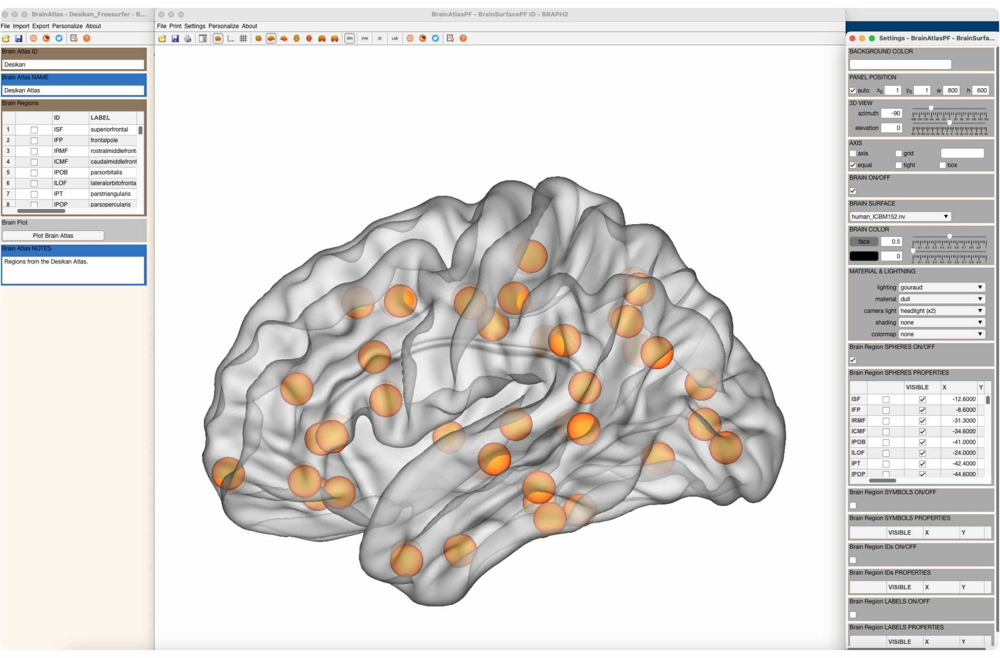
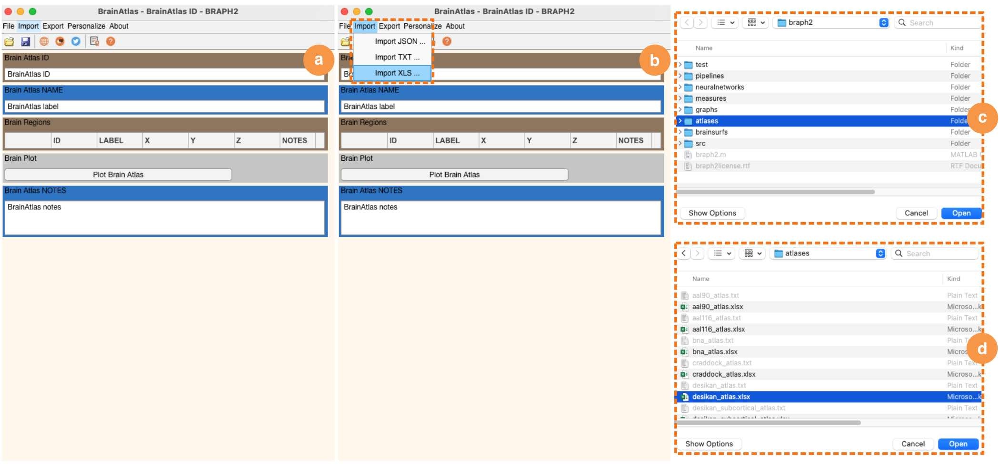
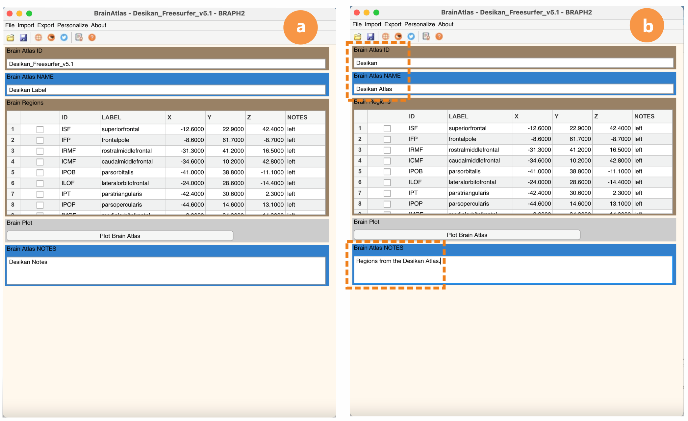
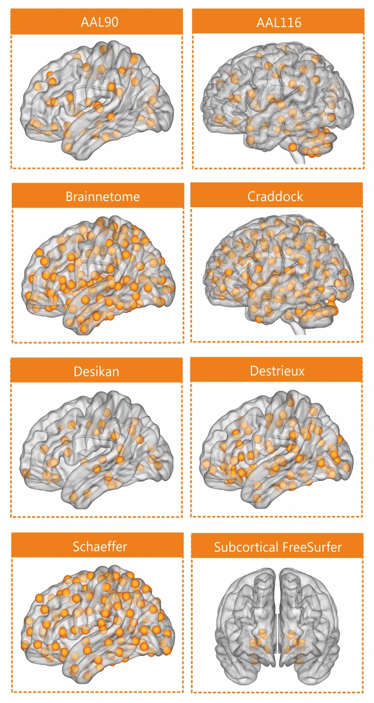
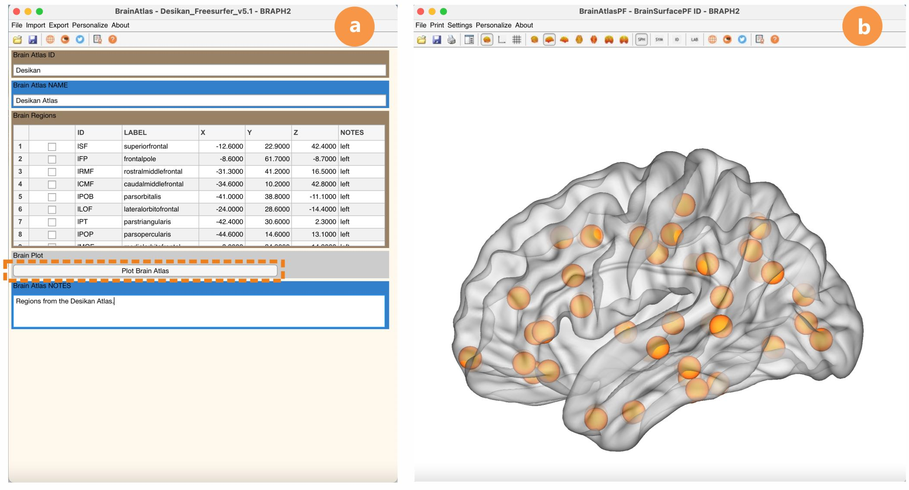
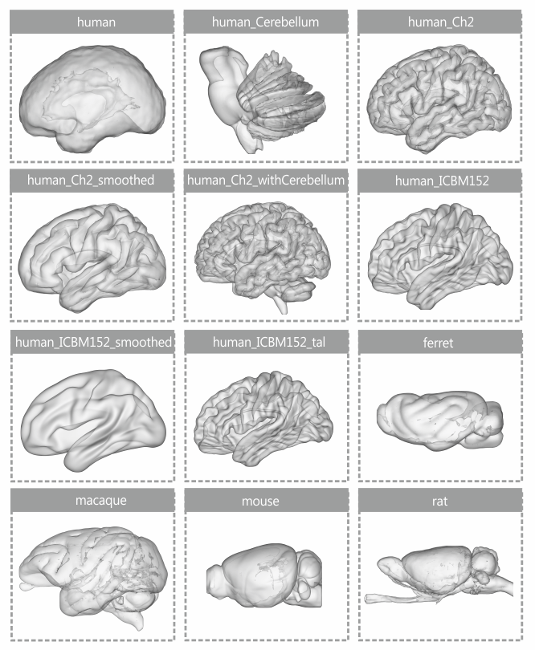

# Brain Atlas

[](tut_ba.pdf)

> 
>
> **Figure 1. Brain atlas figure created with BRAPH 2.0.**
> Example of a brain surface image with some nodes representing brain regions.

This Tutorial explains how to work with the Graphical User Interface (GUI) to manage brain atlases. This is typically the first step required to perform a graph analysis in BRAPH 2.0. In this Tutorial, we will explain how to upload a brain atlas, how to visualize it, and how to export publication-ready brain figures.

> 
> 
> **Figure 2. Brain Atlas GUI.** Full graphical user interface to work with a brain atlas in BRAPH 2.0.

## Open the GUI

The brain atlas GUI is the first step in most BRAPH 2.0 pipelines. You can open it by typing `braph2` in MatLab's terminal, which allows you to select a pipeline containing the steps required to perform your analysis. The initial step is typically to upload the brain atlas directly Figure 3c-d after clicking "Load Atlas". 

> 
> 
> **Figure 3. The different steps you need to follow to open a brain atlas using the GUI:**
> **a** Open the brain atlas GUI.
> **b** Import a brain atlas from an XLS or TXT file.
> **c** Navigate to the BRAPH 2.0 folder `atlases`.
> **d** Select the desired atlas.

> **Brain Atlas GUI launch from command line**
> You can also open the GUI and upload the brain atlas using the command line (i.e., without opening an analysis pipeline) by typing the commands referenced below. In this case, you can upload the atlas as shown in Figure 3a-d.
>
> Commands to open the GUI and upload the brain atlas:
>
> ```matlab
>  ba = BrainAtlas();  % creates a new object `BrainAtlas`.
>  
>  gui = GUIElement('PE', ba);  % creates a GUI to upload the brain atlas.
> gui.get('DRAW');  % draws the GUI.
> gui.get('SHOW');  % shows the GUI.
> ```

## Upload the Brain Atlas

In the GUI launched in the previous step, you have a menu that can be used to import a brain atlas (see figure below) either by loading one of the already-available atlases in the BRAPH 2.0 folder `atlases` (Figure 3c) or by loading a file you have created. In this example, we are uploading the Desikan atlas (Figure 3d).

You can change the ID, name, and notes of the brain atlas (as shown in Figure 4a) as well as the IDs, labels, coordinates, and notes of the brain regions (Figure 4b).

> 
> 
> **Figure 4. Edit the brain atlas information**
> In the brain atlas GUI: 
> **a** We can see the ID, name, brain regions and notes of the brain atlas.
> **b** All of this information can be changed, in this example we have renamed the ID, name and notes of the brain atlas but you can also edit the IDs, labels, coordinates, and notes of the brain regions.

## Ready Brain Atlases

Some brain atlases provided by BRAPH 2.0:
- AAL90: Automated Anatomical Labelling atlas with 90 cortical and subcortical regions.
- AAL116: Automated Anatomical Labelling atlas with 116 cortical and subcortical regions, including cerebellar areas.
- BNA: Brainnetome atlas with 246 cortical and subcortical regions.
- Craddock: Functional atlas with 200 cortical and subcortical regions, including cerebellar areas.
- Desikan: Anatomical atlas with 68 cortical from the FreeSurfer software.
- Destrieux: Anatomical atlas with 148 cortical from the FreeSurfer software.
- Schaefer: Functional brain atlas with 200 cortical regions that belong to 7 different resting-state fMRI networks.
- Subcortical FreeSurfer: Anatomical atlas with 14 subcortical gray matter regions from the FreeSurfer software.

Currently, we provide several brain atlases that are commonly used in the field of brain connectomics, some of which are shown in the figure above. They are available in the BRAPH 2.0 folder `atlases` in XLS and TXT formats.

> 
> 
> **Figure 5. Brain Atlases.**
> Some brain atlases provided by BRAPH 2.0:
> **AAL90:** Automated Anatomical Labelling atlas with 90 cortical and subcortical regions.
> **AAL116:** Automated Anatomical Labelling atlas with 116 cortical and subcortical regions, including cerebellar areas.
> **BNA:** Brainnetome atlas with 246 cortical and subcortical regions.
> **Craddock:** Functional atlas with 200 cortical and subcortical regions, including cerebellar areas.
> **Desikan:** Anatomical atlas with 68 cortical regions from the FreeSurfer software.
> **Destrieux:** Anatomical atlas with 148 cortical regions from the FreeSurfer software.
> **Schaefer:** Functional brain atlas with 200 cortical regions that belong to 7 different resting-state fMRI networks.
> **Subcortical FreeSurfer:** Anatomical atlas with 14 subcortical gray matter regions from the FreeSurfer software.

## Create a New Brain Atlas

To create a new brain Atlas in BRAPH 2.0 format, you should create a new XLS file (.xls or .xlsx), as shown in Figure 6. 
(It is also possible to create it in TXT format (.txt), for which we refer to the examples available in the BRAPH 2.0 folder `atlases`.)

> .
> 
> **Figure 6. Create your own brain atlas.**
> Overview of how the XLS file containing your atlas information should look like.

Start by writing the following information in the first 4 rows:
- Brain Atlas ID (row 1, column 1). For example: Desikan FreeSurfer
- Brain Atlas LABEL (row 2, column 1). For example: Desikan Labels
- Brain Atlas NOTES (row 3, column 1). For example: Desikan Nodes
- Brain Surface Name (row 4, column 1). For example: BrainMeshICBM152.nv

Then, from row 5, you should include the IDs of the regions of your atlas (1st column), the labels of the regions of your atlas (2nd column), the X, Y, and Z coordinates (3rd, 4th, and 5th columns), and any relevant notes (in this case, the brain hemisphere, 6th column).

## Plot the Brain Atlas

Once you are satisfied with the brain atlas, you can plot it by pushing the button "Plot Brain Atlas" (Figure 7a). This will open an image with a brain surface and nodes corresponding to the brain regions.

> 
> 
> **Figure 7. Brain atlas visualization.**
> Plotting the nodes of a brain atlas on a 3D brain surface.

This new window has a large toolbar that allows you to change the visualization of the atlas. We suggest you try the different options to understand how they change the figure. Importantly, within this menu, there is one option called "Settings Brain Surface" (highlighted in Figure 8a), which opens the settings window shown in Figure 8b-c.

> 
> 
> **Figure 8. Visualize the brain atlas.**
> **a** The ``Settings Brain Surface'' button in the toolbar opens **b**-**c** a window with the settings available for this brain figure.

The settings window allows you to optimize how the brain regions included in your analysis are visualized. This is often included as a first figure in a manuscript.

Most things in the settings window are intuitive. So we encourage you to try them out until you achieve the visualization you want. There are many possibilities for visualization. Figure 9 shows just one example.

> 
> 
> **Figure 9. Example of a visualization of the brain atlas.**
> A final figure was created with BRAPH 2.0 by changing different options in the menu.
 
Each brain region can be represented with spheres, symbols, IDs, and labels. Spheres are objects that are rendered in 3D — often prettier, but also more computationally expensive. Symbols are objects rendered in 2D — more stylized and less computationally expensive. IDs and labels are the texts associated with the brain region.

If you wish to apply some properties to a set of brain regions, you can select multiple regions by clicking on the checkboxes on the right, and then right-click and select "apply to selection" before applying some property.

BRAPH 2.0 provides different brain surfaces, as shown in Figure 10, for the human brain and cerebellum in addition to animals such as the ferret, macaque, mouse, and rat. It is also possible to add additional brain surfaces by adding the required NV files in the BRAPH 2.0 folder *brainsurfs*.

> 
> 
> **Figure 10. Brain surfaces in BRAPH 2.0.**
> Some of the brain surfaces available in BRAPH 2.0 to plot the brain atlas.

## Export the Figure

To export and save a (publication-ready) figure, you can select "Print" from the brain atlas GUI and select one of the various provided options (Figure 11).

> 
> 
> **Figure 11. Save a brain atlas figure.**
> BRAPH 2.0 provides different options that allow saving a figure with different resolutions and color modes, adequate to any requirement for presentations and publications.
